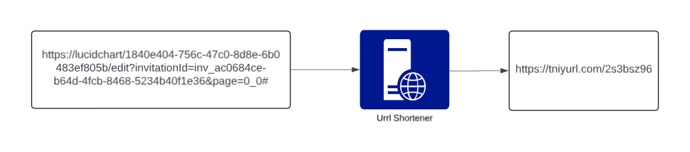
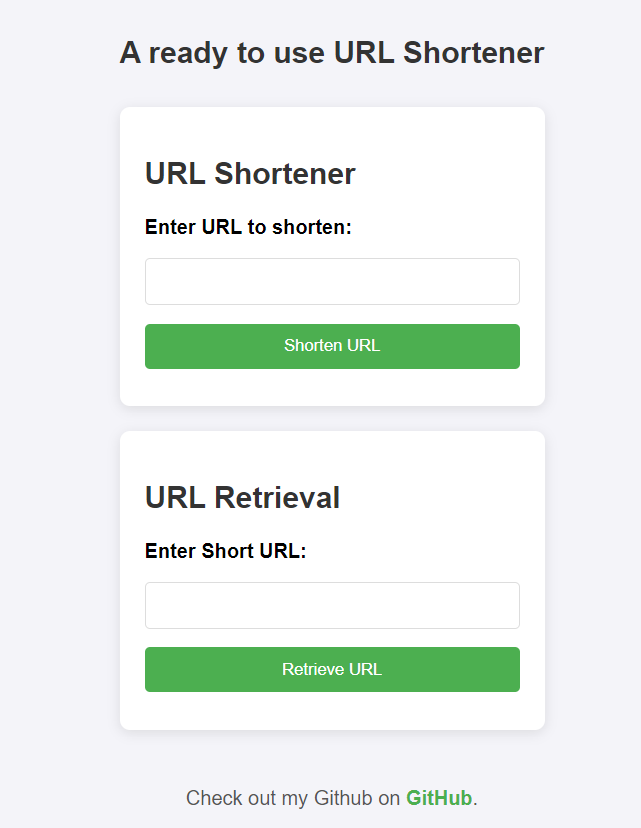

# Url-shortener
An url shortener using python and flask. 

# What we want

## Configuration 
It consists of two parties: 
1. Creating the short URL
2. Redirecting the user from the short URL to the original URL

## The interface 

## Notes
The url shortner works with the base **127.0.0.1:5000**, as it is the default url for Flask, But you can change it for you custom domain.